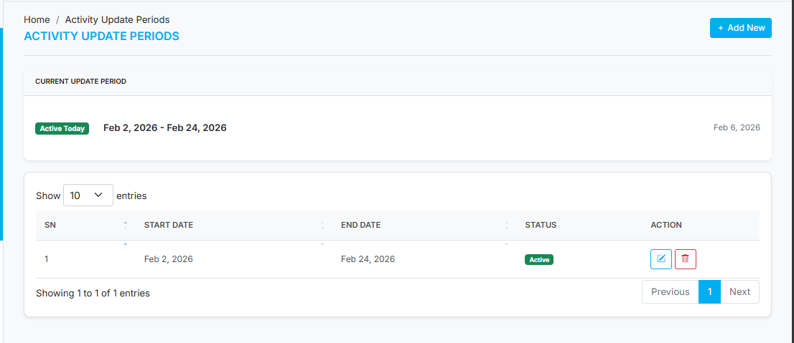
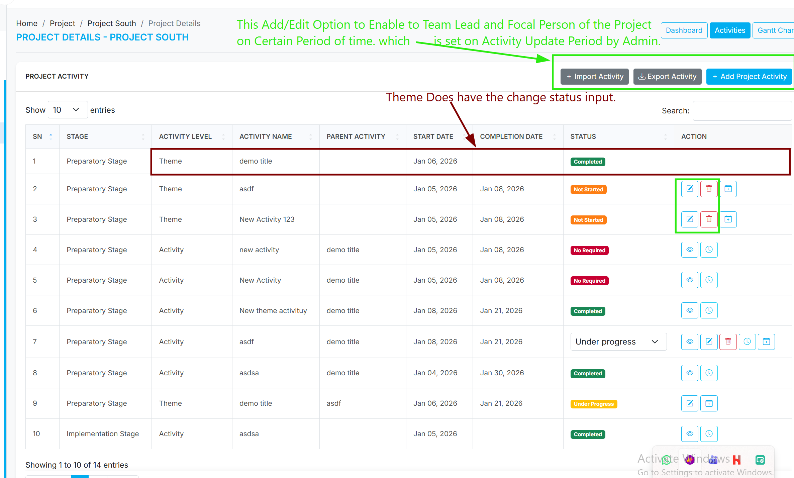

# Project Activity Management Rules

This document outlines the business logic, permissions, and automated behaviors related to **Project Activities** within HRPMS.

## 1. Roles and Permissions

Permissions for managing project activities are based on user roles within a project.

- **Admin**:
    - Can view and manage all projects and their activities.
    - Can define the "Activity Update Period," a global setting that dictates when activities can be added or edited across all projects.

        

- **Team Lead & Focal Person**:
    - Can view all activities for projects they are assigned to.
    - Can add and edit project activities, but only during the globally set "Activity Update Period."

        

- **Member**:
    - Can view activities for projects they are assigned to.
    - Can change the status of assigned activities.

## 2. Activity Hierarchy

Project activities are structured in a three-level hierarchy:

1.  **Theme**: The highest-level grouping, representing a major phase or component of the project.
2.  **Activity**: A specific task or work package that falls under a Theme.
3.  **Sub-Activity**: A more granular task that is part of an Activity.

This structure is defined in the `ActivityLevel` enum.

## 3. Status Management

The status of each activity indicates its progress. Statuses are defined in the `ActivityStatus` enum: `Not Started`, `Under Progress`, `Completed`, and `No Required`.

### 3.1. Manual Status Updates

- When a user updates the status of an activity, the change is logged with the user's ID, the old status, the new status, and any remarks.
- The `actual_start_date` is automatically set when an activity's status changes to `Under Progress` for the first time.
- The `actual_completion_date` is set when the status changes to `Completed` or `No Required`.

### 3.2. Status Update Rules

There are specific constraints on how statuses can be changed:

- An activity's status can only be changed to **`Completed`** if its current status is **`Under Progress`**. This ensures that tasks are properly tracked as they are being worked on before being marked as finished. This is enforced in the UI.
- The ability to change a status is only available if the activity level is not `Theme` and the status is not already `Completed` or `No Required`. This is handled by the `checkStatusDisplay` method in `ProjectActivityController`.

### 3.3. Hierarchical (Automatic) Status Propagation

To maintain consistency, the status of parent activities is automatically updated based on the status of their children. This logic applies when an `Activity`'s status changes, affecting its parent `Theme`.

- **`Under Progress`**: If **any** child `Activity` under a `Theme` is moved to `Under Progress`, the parent `Theme` is automatically updated to `Under Progress`.
- **`Completed`**: If **all** child `Activities` under a `Theme` are `Completed` (or `No Required`), the parent `Theme` is automatically marked as `Completed`.
- **`Not Started`**: If all child `Activities` are `Not Started`, the parent `Theme` will also be `Not Started`.

**Note**: This automatic propagation rule applies from `Activity` to `Theme`. It does not apply from `Sub-Activity` to `Activity`. This logic is handled in the `updateParentActivity` method in `ProjectActivityController`.
